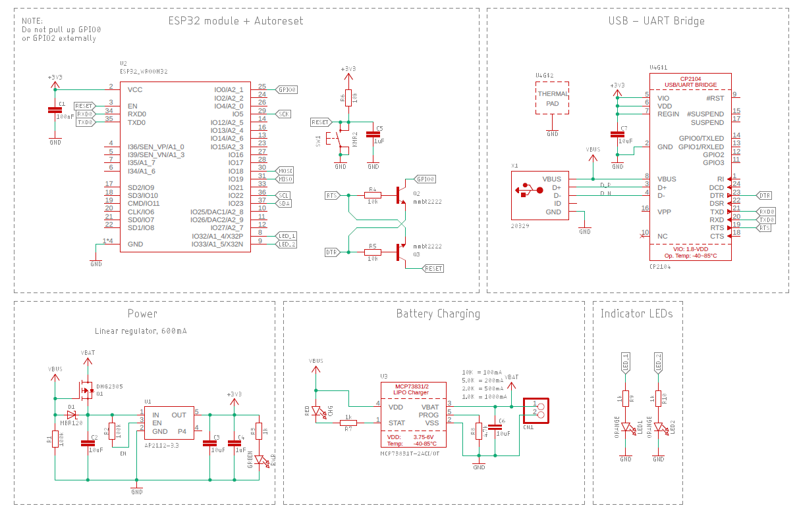
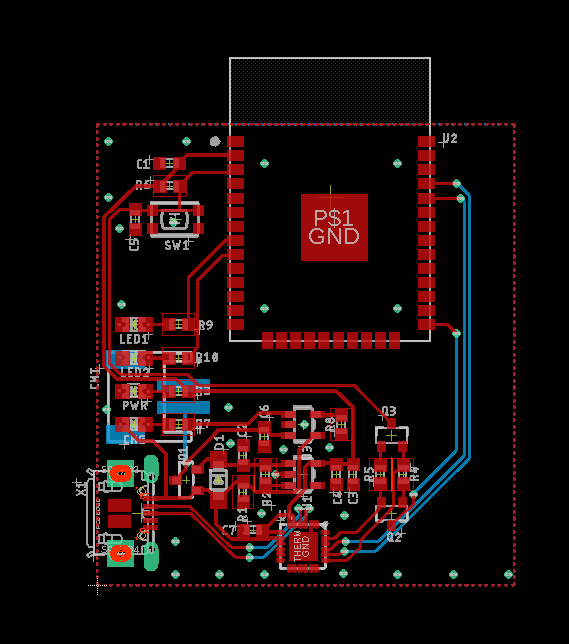

# ESP32 WROOM32  Module
The ESP32 chipset is very popular in applications requiring Wi-Fi, Bluetooth or both. The dual core IC is Arduino compatible, but offers more "advanced" features that can be accessed using Espressif's toolchain (esp_idf). The WROOM32 module makes using this chipset extremely easy: it comes with an antenna and is already CE - FCC certified.

## About Eagle Design Blocks
This is an Eagle design block with a schematic and a layout that you can incorporate as is in one of your designs. To know more about Eagle Design blocks check out:
* [Using Eagle Design blocks - Autodesk](https://www.autodesk.com/products/eagle/blog/whats-new-in-autodesk-eagle-modular-design-blocks/)

* [Using Eagle Design blocks - Adafruit](https://learn.adafruit.com/making-pcbs-with-oshpark-and-eagle/creating-a-schematic-with-design-blocks)

## Features
* ESP32 WROOM module
* Auto-reset for easy programming
* CP2104 USB-UART Bridge
* 1S Battery Barger
* 600mA 3.3V LDO
* Reset button
* 2x Indicator LEDs
>Note: the WROOM32 module comes with a pre-loaded bootloader

## Schematic
>Note: Do not pullup or pulldown GPIO0 and GPIO2 externally

## Layout

## Datasheet(s)
* [ESP32_WROOM32](https://www.espressif.com/sites/default/files/documentation/esp32-wroom-32_datasheet_en.pdf)
* [CP2104](https://www.silabs.com/documents/public/data-sheets/cp2104.pdf)
* [AP2114](https://www.diodes.com/assets/Datasheets/AP2114.pdf)
* [MCP73831-2](https://cdn.sparkfun.com/assets/learn_tutorials/6/9/5/MCP738312.pdf)

## Resources
* [CP210x Drivers](https://www.silabs.com/products/development-tools/software/usb-to-uart-bridge-vcp-drivers)
* [Arduino on ESP32](https://github.com/espressif/arduino-esp32#using-through-arduino-ide)
> In this schematic, the module is connected to match the [Adafruit Huzzah32](https://learn.adafruit.com/adafruit-huzzah32-esp32-feather) board. Should you want to use different I2C, SPI or UART defaults, make sure you match them to the board you select in the Arduino IDE
* [Getting started with the ESP32 - Not Arduino](https://hackaday.com/2016/10/04/how-to-get-started-with-the-esp32/)
* [ESP-IDF programming guide](https://docs.espressif.com/projects/esp-idf/en/latest/esp32/)
