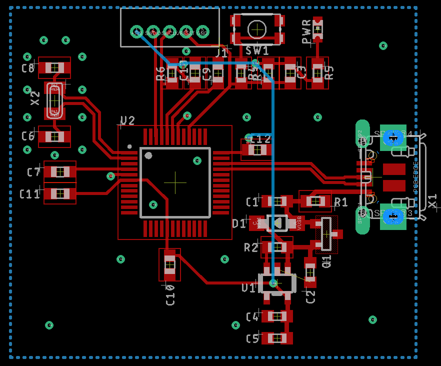

# SAMD21G18
This chip has a 32bit Cortex M0+ CPU and is very versatile, especially in applications that require many forms of serial communication:

It is Arduino compatible and has native USB + six serial communication interfaces that can be configured to be either UART, I2C or SPI depending on needs.

##  About Eagle design blocks

[Using Eagle Design blocks - Autodesk](https://www.autodesk.com/products/eagle/blog/whats-new-in-autodesk-eagle-modular-design-blocks/)

[Using Eagle Design blocks - Adafruit](https://learn.adafruit.com/making-pcbs-with-oshpark-and-eagle/creating-a-schematic-with-design-blocks)

## Features
* **Operating voltage:** 1.62V – 3.63V

* **Processor:** ARM Cortex-M0+ CPU running at up to 48MHz

* **Memory**
  * 256KB in-system self-programmable Flash
  * 32KB SRAM Memory

* **System**
  * Power-on reset (POR) and brown-out detection (BOD)
  * Internal and external clock options with 48MHz
  * 16 external interrupts
  * Two-pin Serial Wire Debug (SWD) programming, test and debugging

* **Peripherals**
  * 12-channel Direct Memory Access Controller (DMAC)
  * 12-channel Event System
  * Up to five 16-bit Timer/Counters (configurable)
  * 32-bit Real Time Counter (RTC) with clock/calendar function
  * Watchdog Timer (WDT)
  * USB 2.0 interface
  * Six Serial Communication Interfaces (SERCOM), each configurable to operate as either:USART, I2C, SMBUS/PMBUS, SPI, LIN slave
  * 12-bit ADC with up to 14 channels
  * 10-bit DAC
  * Two Analog Comparators (AC) with window compare function
  * Peripheral Touch Controller (PTC)
  * 256-channel capacitive touch and proximity sensing

## Schematic
Basic schematic with USB, programming interfaces and LDO

## Layout

## Datasheet
* [SAMD21G18](http://ww1.microchip.com/downloads/en/DeviceDoc/SAM_D21_DA1_Family_DataSheet_DS40001882F.pdf)

## Sourcing Links
* [SZLCSC](https://item.szlcsc.com/79760.html)

## Using the SAMD21G18 with Arduino
This chip is used on the Arduino Zero and Arduino MKR, as well as the Adafruit M0 board. Here are some helpful resources in getting started with this board

**SETUP**

* [Getting started with this chip on Arduino - Adafruit](https://learn.adafruit.com/adafruit-feather-m0-adalogger/using-with-arduino-ide)
* [Flashing the bootloader using a Raspberry pi and OpenOCD](https://learn.adafruit.com/programming-microcontrollers-using-openocd-on-raspberry-pi)

**PROGRAMMING**

* [configuring SERCOMs](https://learn.adafruit.com/using-atsamd21-sercom-to-add-more-spi-i2c-serial-ports)
* [Adapting Arduino Sketches](https://learn.adafruit.com/adafruit-feather-m0-adalogger/adapting-sketches-to-m0)
