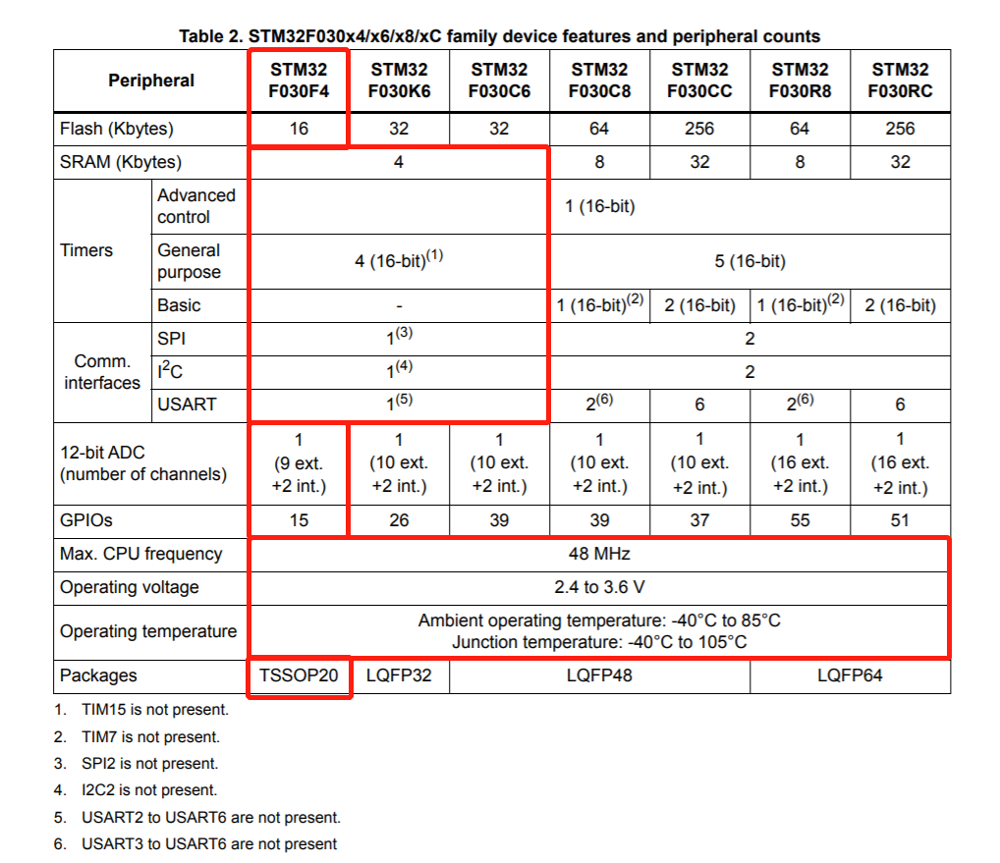
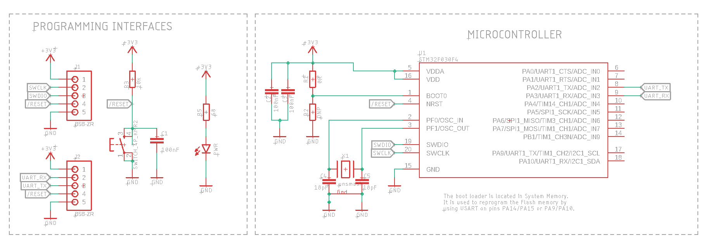
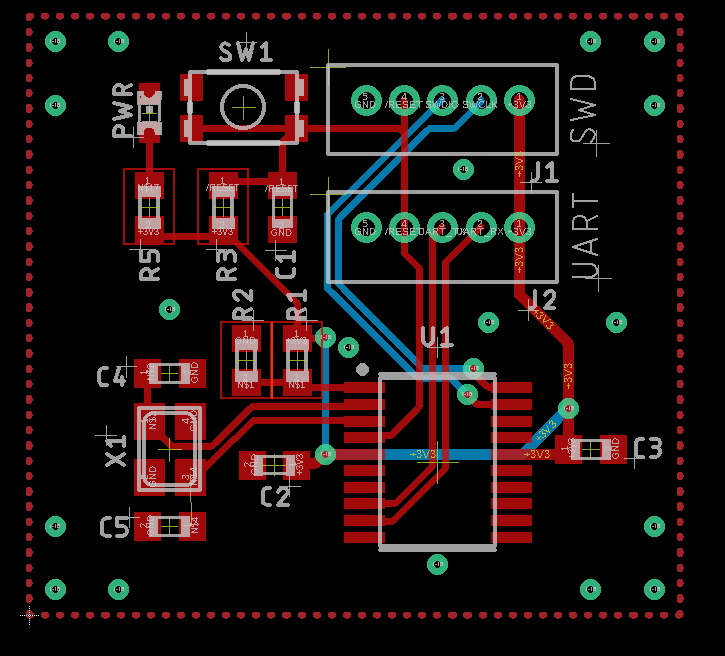
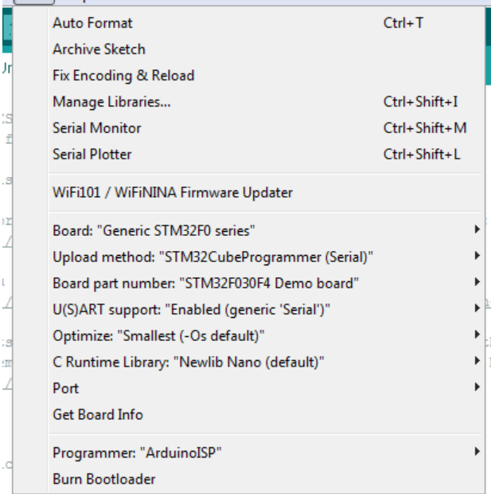

# STM32F030

Low-end 32-bit Cortex M0 microcontroller, with all the basic peripherals (UART, I2C, SPI, ADC, DMA, etc.)

Ideal for simple, low cost applications or nodes in distributed systems.

##  About Eagle design blocks

[Using Eagle Design blocks - Autodesk](https://www.autodesk.com/products/eagle/blog/whats-new-in-autodesk-eagle-modular-design-blocks/)

[Using Eagle Design blocks - Adafruit](https://learn.adafruit.com/making-pcbs-with-oshpark-and-eagle/creating-a-schematic-with-design-blocks)

## Features

## Schematic

## Layout

## Resources
* [Datasheet](https://www.st.com/resource/en/datasheet/stm32f030f4.pdf#page=12&zoom=100,89,736)
* [Programming Manual](https://www.st.com/resource/en/programming_manual/dm00051352-stm32f0xxx-cortexm0-programming-manual-stmicroelectronics.pdf)
* [Reference Manual](https://www.st.com/resource/en/reference_manual/DM00091010-.pdf)

## Sourcing Links
* [SZLCSC](https://item.szlcsc.com/33873.html)

## Programming
You can use both the SWD and UART interfaces to program the chi:
* UART: Use an external USB-UART bridge
* SWD: you need an external programmer. You can use a J-Link, an ST-Link (standalone or nucleo board), etc.

### Using the STM32F030 with STMCubeMX
* [Full tutorial with Visual Studio Code](https://gitlab.com/hax_eng/hax-open/vs_code_setup_tutorials/-/tree/master/STM32)
> Note: you can use both the UART and the SWD interfaces with this method

### Using the STM32F030 with Arduino
* [STM32duino](https://github.com/stm32duino/Arduino_Core_STM32)
> Note select STM32F030F4 as target board

