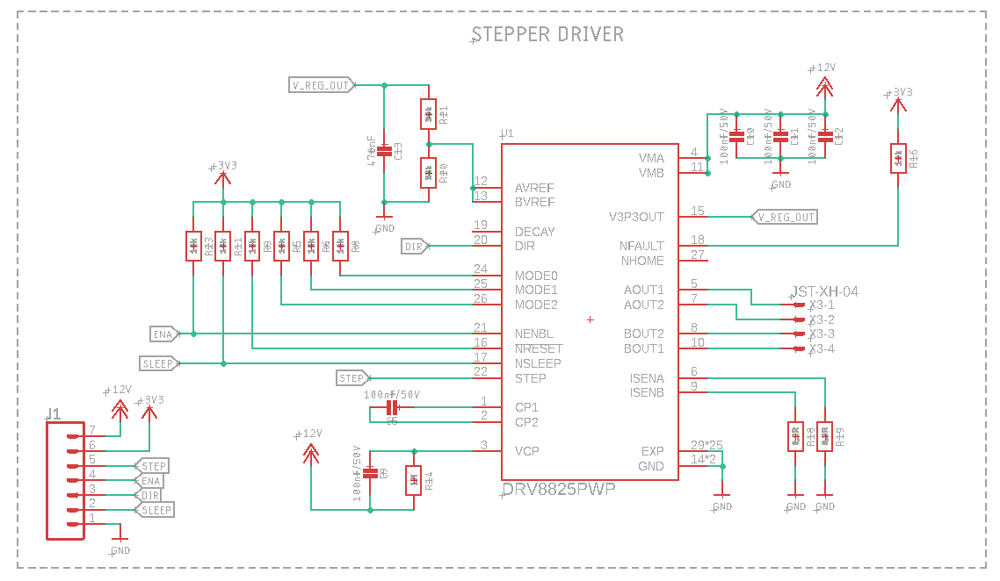
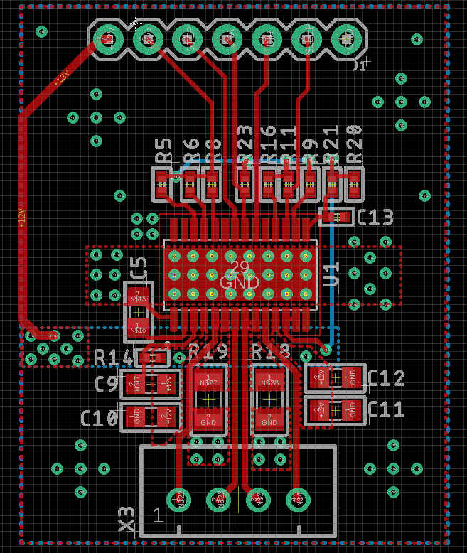

# DRV8825

DRV8825 Stepper Driver, Eagle design block

[Using Eagle Design blocks - Autodesk](https://www.autodesk.com/products/eagle/blog/whats-new-in-autodesk-eagle-modular-design-blocks/)

[Using Eagle Design blocks - Adafruit](https://learn.adafruit.com/making-pcbs-with-oshpark-and-eagle/creating-a-schematic-with-design-blocks)

## Features
Stepper driver with current regulation up to 2.5A @24V

|Parameter | Value|
|:---:|:---:|
|V motor|8.2V to 45V|
|V logic LOW|0 - 0.7V|
|V logic HIGH|2.2V - 5.2V|
|I max|2.5A|

> Note: 2.5A current limit assumes a good thermal design. See datasheet for details 

### Current regulation
**How it works:**
 The current through the motor windings is regulated by a fixed-frequency PWM current regulation. Once the current hits the current chopping threshold, the bridge disables the
current until the beginning of the next PWM cycle.
 I_max = (V_xref)/(5xV_Rsense)

**Example:**
If a 0.25-Ω sense resistor is used and the VREFx pin is 2.5 V, the full-scale (100%) chopping current will be
2.5 V / (5 x 0.25 Ω) = 2 A.

## Schematic
>Note: Sleep and ENA should be pulled up externally, not the internal 3V3 regulator (because it turns off when the driver is disabled or in sleep mode)

## Layout

## Datasheet
* [DRV8825](https://www.ti.com/lit/ds/symlink/drv8825.pdf?ts=1595426362067&ref_url=https%253A%252F%252Fwww.google.com%252F)

## Sourcing Links
* [SZLCSC](https://item.szlcsc.com/82734.html)
