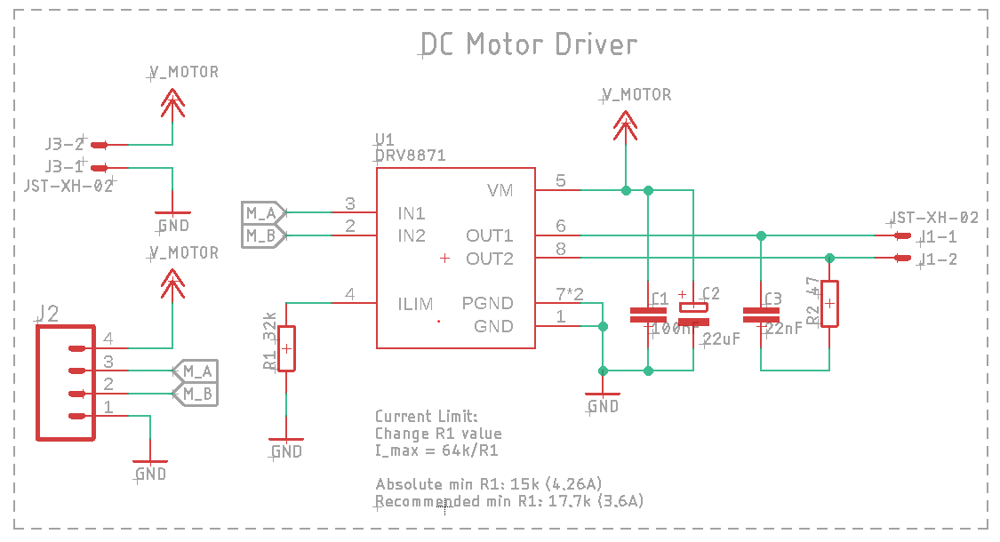
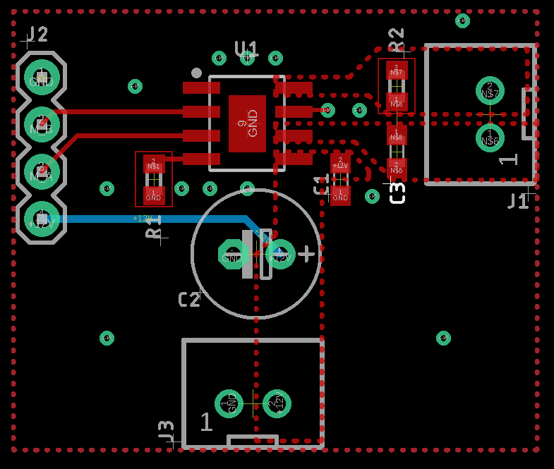

# DRV8871

3.6-A Brushed DC Motor Driver With Internal Current Limiting (PWM control).

>Note: Unlike the DRV8876, this driver does not have a current sense
output

**Eagle design block**

[Using Eagle Design blocks - Autodesk](https://www.autodesk.com/products/eagle/blog/whats-new-in-autodesk-eagle-modular-design-blocks/)

[Using Eagle Design blocks - Adafruit](https://learn.adafruit.com/making-pcbs-with-oshpark-and-eagle/creating-a-schematic-with-design-blocks)

## Features

|Parameter | Value|
|:---:|:---:|
|V motor|6.5V to 45V|
|V logic LOW|0 - 0.5V|
|V logic HIGH|1.5V - 5.5V|
|I max|3.6A peak|

## Schematic
>Note: Sleep and ENA should be pulled up externally, not the internal 3V3 regulator (because it turns off when the driver is disabled or in sleep mode)

## Layout

## Datasheet
* [DRV8871](https://www.ti.com/lit/ds/symlink/drv8871.pdf)

## Sourcing Links
* [SZLCSC](https://item.szlcsc.com/76991.html)
