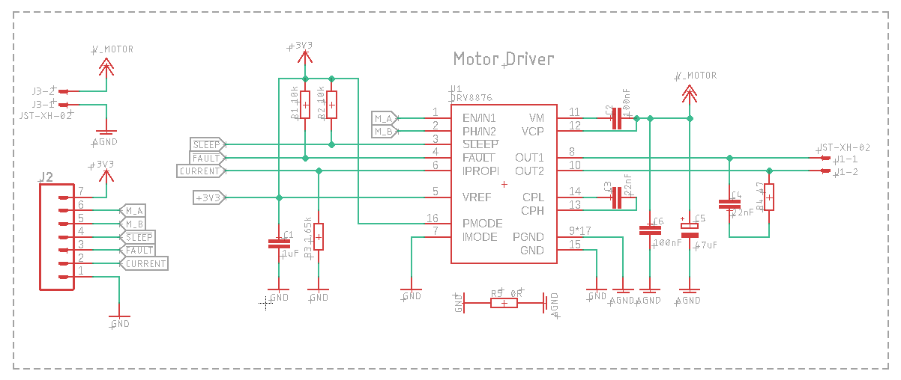
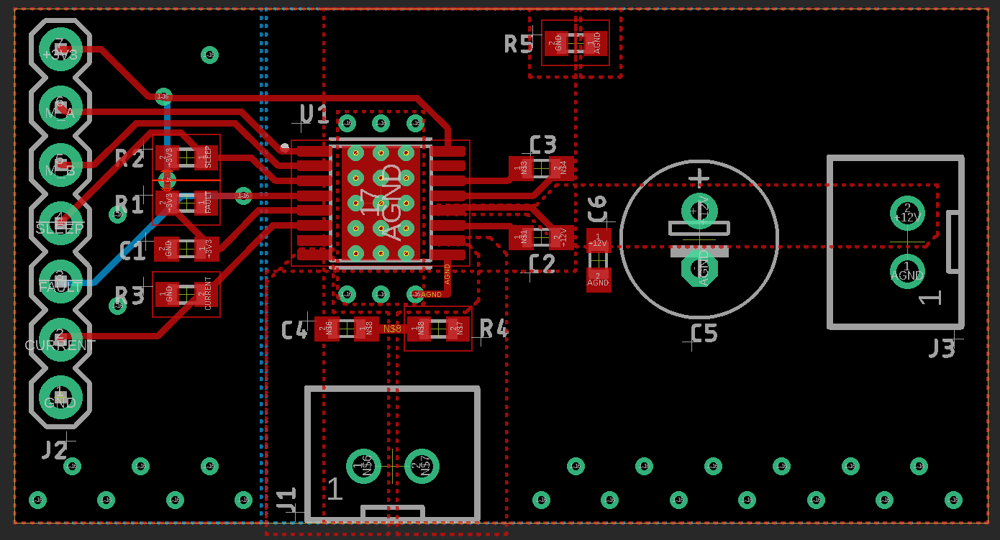

# DRV8876

H-Bridge Motor Driver With Integrated Current Sense and Regulation (3A)

**Eagle design block**

[Using Eagle Design blocks - Autodesk](https://www.autodesk.com/products/eagle/blog/whats-new-in-autodesk-eagle-modular-design-blocks/)

[Using Eagle Design blocks - Adafruit](https://learn.adafruit.com/making-pcbs-with-oshpark-and-eagle/creating-a-schematic-with-design-blocks)

## Features

|Parameter | Value|
|:---:|:---:|
|V motor|4.5V to 37V|
|V logic LOW|0 - 0.7V|
|V logic HIGH|1.5V - 5.5V|
|I max|3.5A peak|

### Control signals
* M_A: motor control signal A (PWM or DIR)
* M_B: motor control signal A (PWM or DIR)
* nFAULT: fault signal
* nSLEEP: sleep signal
* Current: analog value proportional to motor current

>Note: Current signal value is scaled from VREF, in this schematic VREF is connected to 3.3V, see datasheet section on current sensing nad regulation

## Schematic
>Note: Sleep and ENA should be pulled up externally, not the internal 3V3 regulator (because it turns off when the driver is disabled or in sleep mode)

## Layout

## Datasheet
* [DRV8876](https://www.ti.com/lit/ds/symlink/drv8876.pdf?ts=1595503442771&ref_url=https%253A%252F%252Fwww.google.com%252F)

## Sourcing Links
* [SZLCSC](https://item.szlcsc.com/602109.html)

## Ready to use module
* [Mike Reed's 0-3A motor driver board](https://gitlab.com/hax_eng/hax-open/dc_motor_driver_0-3a)
