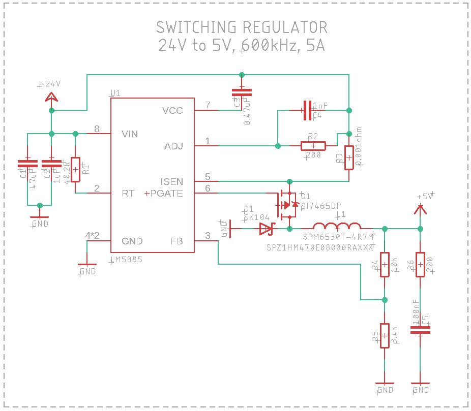
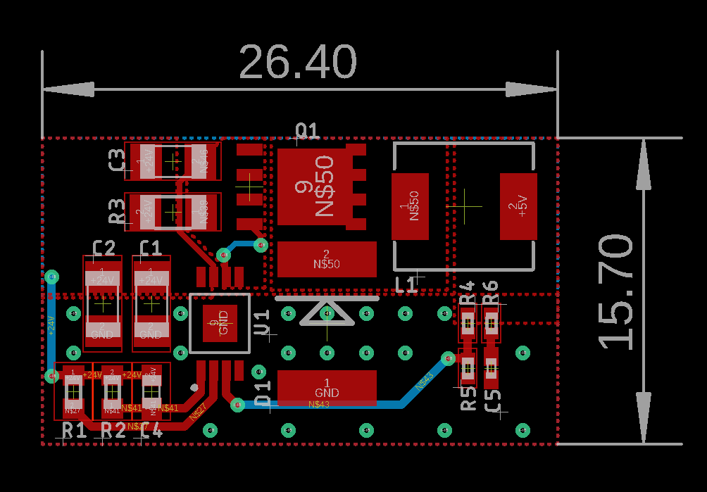

# LM5085 Switching Regulator

24V to 5V @ 5A Switching Regulator. Adjustable current limit, input & output voltage.

## About
The LM5085 is a very versatile buck regulator, with a very wide input voltage window and an adjustable current limit up to 10A. To modify the design, go over the application design section of the datasheet. You can also refer to the design calculator to crosscheck your numbers.

This file is an [Eagle design block](https://www.autodesk.com/products/eagle/blog/whats-new-in-autodesk-eagle-modular-design-blocks/). To use it in any eagle design of your choice, click on the "add design block" icon in your board or schematic editors and you'll be able to
add the pre-made schematic and layout portion to a new or an existing design.
> To keep things simple, you can save the design block file in the Design Block folder from your Eagle directory. On my Windows PC it is in: Documents/EAGLE/design blocks

### Key specs

| Param | Values |
|:---:|:---:|
|Vin|4.5V - 42V|
|Vout|1.25V - 42V|
|Iout| up to 10A|
|Freq|50kHz - 1MHz|
|Iq|1.25mA|

## References
* [LM5085 datasheet](https://www.ti.com/product/LM25085)
* [Design Calculator](https://www.ti.com/tool/LM25085-5085QUICK-CALC): you can use this as a reference to calculate or crosscheck your numbers when modifying the design

## Schematic
   

## Layout

